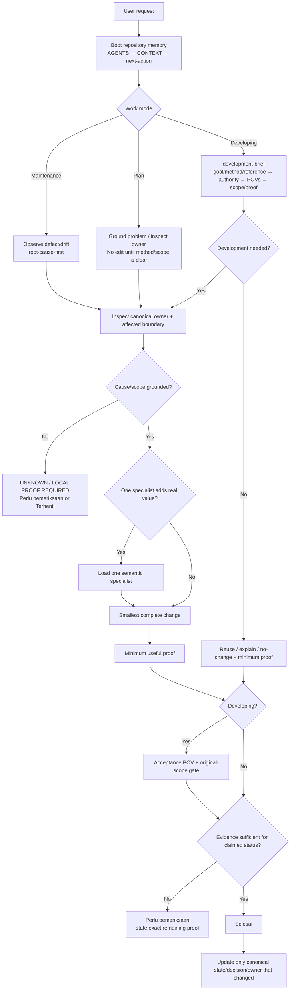

# Agent Work Routing Flow

Updated: 2026-08-10

Use this note as the single **agent work-routing map**. It is separate from the product production sequence in `docs/foundation/01-production-flow.md`.

## Agent Routing



## Developing Owner Budget

```text
development-brief
+ at most one useful specialist
```

Select by semantic owner:

- Source / requirement recovery / PRD / HTML PRD / PRD readiness → `project-document-production`;
- Voice requirements / script / DOCX / Voice delivery → `voice-production`.

Do not select by incidental file format or technology.

## Production Flow Is A Separate Layer

Agent routing decides **how work is approached**. Production Flow decides **which product stage owns the project artifact**.

```text
Agent routing
Plan / Developing / Maintenance
        ↓
semantic owner + proof boundary
        ↓
Product production flow
Flow 2 → Flow 3 → Flow 4 → Flow 5 → Flow 6 → Flow 7
```

A Maintenance task may repair Flow 6 without restarting Flow 2. A Developing request may start directly at Flow 5 only when a current `handoff_ready` PRD already exists and the requested goal belongs there.

## Plan Mode

Use when the problem, architecture, or high-impact decision is not yet grounded.

- inspect repository/project evidence before proposing structure;
- separate goal from suggested method;
- identify the canonical owner before proposing a new file/skill/layer;
- do not implement merely to make the plan feel concrete;
- end with one actionable next step.

## Developing Mode

Use `development-brief` before non-trivial implementation.

See `flows/development-flow.md` for the detailed route.

## Maintenance Mode

Use for bugs, regressions, cleanup, stale routing/docs, and behavior-preserving corrections.

Phase 1 establishes the root-cause-first baseline in `AGENTS.md`. A dedicated maintenance workflow/review lifecycle is the next operating-architecture parity phase; until then, Maintenance must still obey:

```text
observe concrete failure/drift
→ identify canonical owner
→ ground cause
→ smallest correction
→ targeted proof
→ update only changed state
```

Do not turn maintenance into feature/abstraction work unless the root cause proves it necessary.

## Evidence Boundary

When a material claim cannot be proven in the active execution channel, use root evidence statuses rather than pretending static inspection proves runtime/browser/audio behavior.

## Continuity

New session:

`AGENTS.md` → `CONTEXT.md` → `next-action.md`

Open the activation matrix only when selecting a skill. Do not load the task board or every kit during normal boot.

## Related

- [Development Flow](flows/development-flow.md)
- [Skill Activation Matrix](skills/activation-matrix.md)
- [Skill Map](skills/skill-map.md)
- [Implementation Map](implementation-map.md)
