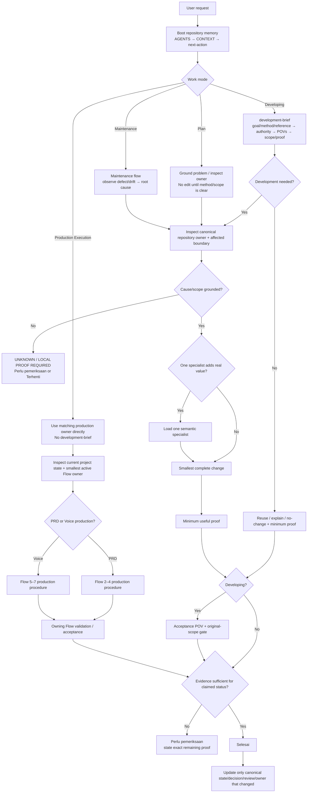

# Agent Work Routing Flow

Updated: 2026-08-10

Use this note as the single **agent work-routing map**. It is separate from the product production sequence in `docs/foundation/01-production-flow.md`.

## Agent Routing



## Mode Boundary

### Production Execution

Use when the user is using the existing system to create or revise project deliverables.

Examples:

```text
create PRD from supplied project source
revise an existing approved PRD objective
extract Voice requirements from accepted PRD
produce/update Voice Production output
```

Production Execution bypasses `development-brief`. Use the matching production owner and smallest active Flow procedure directly.

### Developing

Use when the user asks to change **PRD-Creator itself**: its policy, skills, workflow, renderer/validator/builder contracts, repository structure, or shared tooling.

## Developing Owner Budget

```text
development-brief
+ at most one useful specialist
```

Select by semantic owner:

- PRD-Creator source/recovery/PRD/handoff system changes → `project-document-production`;
- Voice system/contract changes → `voice-production`.

Do not select by incidental file format or technology.

## Production Flow Is A Separate Layer

Agent routing decides **how work is approached**. Production Flow decides **which product stage owns the project artifact**.

```text
Agent routing
Plan / Production Execution / Developing / Maintenance
        ↓
semantic owner + proof boundary
        ↓
Product production flow
Flow 2 → Flow 3 → Flow 4 → Flow 5 → Flow 6 → Flow 7
```

Normal PRD Production Execution routes directly into Flow 2–4. Normal Voice Production Execution routes directly into Flow 5–7 when its upstream entry boundary is satisfied.

A Maintenance task may repair Flow 6 without restarting Flow 2. A repository Developing request may change the Flow 5 system without running an actual Voice project.

## Plan Mode

Use when the problem, architecture, or high-impact decision is not yet grounded.

- inspect repository/project evidence before proposing structure;
- separate goal from suggested method;
- identify the canonical owner before proposing a new file/skill/layer;
- use `decisions/change-decision-guide.md` only when a cross-owner durable change threshold is actually met;
- do not implement merely to make the plan feel concrete;
- end with one actionable next step.

## Production Execution Mode

Use the owning production procedure directly.

For PRD:

```text
project-document-production
→ kits/project-document-generator/ active Flow owner
```

For Voice:

```text
voice-production
→ kits/voice-production-kit/ active Flow owner
```

Keep user effort low: auto-bootstrap internal project state, inspect before asking, batch decisions, use delta revision paths, and deliver only the requested artifact plus concise material information.

## Developing Mode

Use `development-brief` before non-trivial **repository/system** implementation.

See `flows/development-flow.md` for the detailed route.

## Maintenance Mode

Use for bugs, regressions, cleanup, stale routing/docs, and behavior-preserving corrections.

Canonical procedure:

`maintenance/maintenance-flow.md`

Maintenance does not automatically use `development-brief`. It begins from concrete defect/drift evidence and root cause, then uses the smallest semantic owner/proof needed.

## Ownership / Source Routing

When the owner or authority is unclear:

1. `modules/module-map.md` — which repository area owns the responsibility;
2. `sources/source-map.md` — which source/state/artifact is authoritative for the claim;
3. `implementation-map.md` — exact current implementation/procedure location.

Do not broad-scan the repository when one of these maps already resolves the boundary.

## Review / Decision Separation

```text
review evidence/history
→ reviews/review-graph.md

durable choice/reason
→ decision-log.md / decisions/

active task status
→ next-action.md
```

A review does not become current policy merely because it contains a recommendation.

## Evidence Boundary

When a material claim cannot be proven in the active execution channel, use root evidence statuses rather than pretending static inspection proves runtime/browser/audio behavior.

## Continuity

New session:

`AGENTS.md` → `CONTEXT.md` → `next-action.md`

Open the activation matrix only when selecting a skill. Do not load the task board, review graph, or every kit during normal boot unless the active boundary requires them.

## Related

- [Development Flow](flows/development-flow.md)
- [Maintenance Flow](maintenance/maintenance-flow.md)
- [Skill Activation Matrix](skills/activation-matrix.md)
- [Skill Map](skills/skill-map.md)
- [Module Map](modules/module-map.md)
- [Source Map](sources/source-map.md)
- [Review Graph](reviews/review-graph.md)
- [Implementation Map](implementation-map.md)
