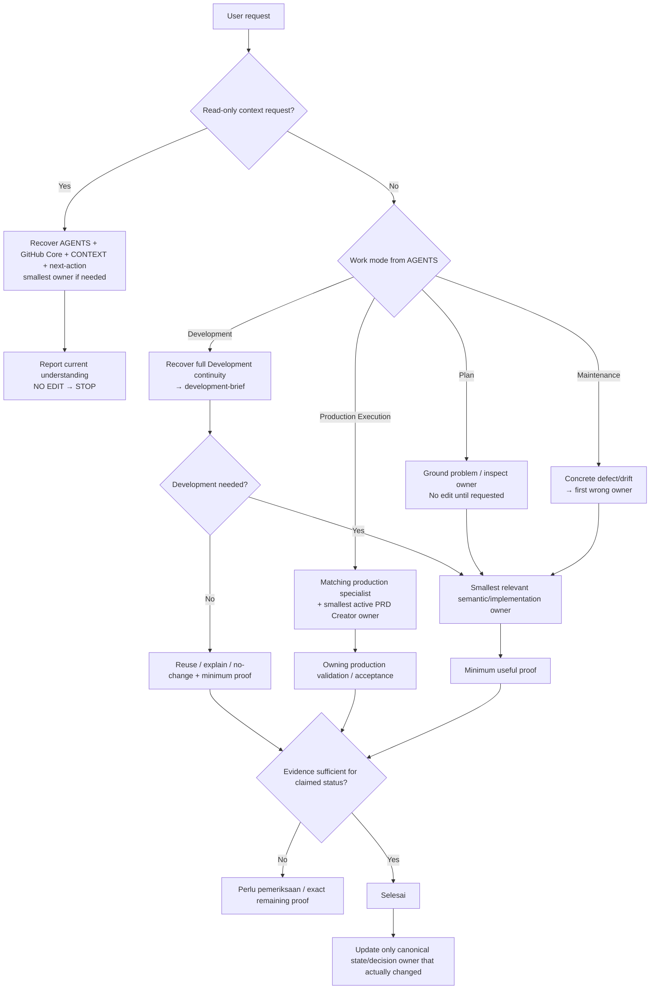

# Work Routing

Updated: 2026-08-30

Root `AGENTS.md` is the canonical top-level work-mode/boot authority. This file is the **detailed explanation** used only when the route or boundary needs more context. It is separate from the product production sequence in `docs/foundation/01-production-flow.md`.

## Routing overview



## Context recovery is not implementation

When the user says only `amati`, inspect, understand, study, or recover the repository:

```text
AGENTS.md
→ GITHUB_RULES.md Core Rules when GitHub work is material
→ CONTEXT.md
→ next-action.md
→ smallest owner needed to explain the current state
→ report understanding
→ STOP
```

Do not execute the recorded next step merely because it was discovered. Do not promote backlog/audit/TODO items. If the user says `amati ... lalu lanjutkan next step`, finish context recovery first, then enter Development/Production/Maintenance as appropriate.

## Non-trivial Development continuity

Repository/system Development must survive session limits. Before editing:

```text
AGENTS.md
→ GITHUB_RULES.md Core Rules
→ CONTEXT.md
→ next-action.md
→ development-brief
→ smallest relevant owner/source
```

This is **minimum sufficient context**, not unnecessary ceremony. After this continuity bootstrap, further reading must remain bounded to what can change the decision.

If `next-action.md` disagrees materially with current source/state, do not blindly follow either. Verify the exact current owner, reconcile the stale continuity/implementation record, then continue from actual state.

## Mode boundaries

### Plan

Use when the user wants understanding/decision support or when a high-impact method/scope is not yet grounded. Inspect authority/ownership first. Do not implement merely to make the plan feel concrete.

### Production Execution

Use when the user is using the existing system to create/revise project deliverables.

```text
PRD / non-Voice 04
→ project-document-production
→ kits/prd-creator/ Project/PRD domain owner

Voice
→ voice-production
→ kits/prd-creator/ Voice domain owner
```

Normal Production Execution bypasses `development-brief`.

### Development

Use when changing **PRD-Creator itself**: policy, skills, workflows, renderer/validator contracts, repository structure, or shared tooling.

```text
development-brief
+ at most one semantic specialist when it adds real value
```

Detailed procedure: `work-modes/development.md` → canonical `development-brief` skill.

### Maintenance

Use for bugs, regressions, cleanup, stale routing/docs, and behavior-preserving corrections. Begin from concrete defect/drift and the first wrong owner. Maintenance does not automatically invoke `development-brief`.

Detailed procedure: `work-modes/maintenance.md`.

## Semantic vs technical routing

Choose the owner by **what is wrong**, not by file format/language:

```text
PRD/source/04/readiness meaning wrong
→ project-document-production

Voice scope/wording/readiness meaning wrong
→ voice-production

semantic contract correct; renderer/template/validator mechanics wrong
→ kits/prd-creator/AGENTS.md + exact implementation owner

shared dependency / test / CI wrong
→ repository engineering owner
```

Use `skills/activation-matrix.md` only when this remains genuinely ambiguous.

## Production flow is a separate layer

Agent work mode answers **how to approach the task**. Product Flow answers **which production stage owns the artifact**.

```text
Plan / Production Execution / Development / Maintenance
→ semantic/implementation owner
→ Flow 2 → Flow 3 → Flow 4 → Flow 5 → Flow 6 → Flow 7 as applicable
```

A Maintenance task may repair Flow 6 without restarting Flow 2. A repository Development task may change the 04 system without producing a project.

## Ownership / source ambiguity

- `ownership.md` → **who owns** the responsibility/file/procedure?
- `source-authority.md` → **which source/state** is authoritative for the claim?

Open only when direct routing does not already answer the question.

## Continuity and inactive work

```text
active continuation
→ next-action.md

future/non-active work
→ operations/backlog.md

historical evidence
→ reviews/history/

durable rationale
→ decisions/
```

Old TODOs, review findings, decisions, and backlog items are not active work by themselves.

## Related

- [Development Workflow](work-modes/development.md)
- [Maintenance Workflow](work-modes/maintenance.md)
- [Skill Activation Matrix](skills/activation-matrix.md)
- [Repository Ownership](ownership.md)
- [Source Authority](source-authority.md)
